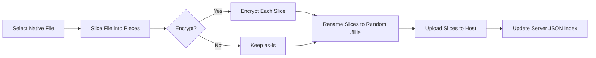
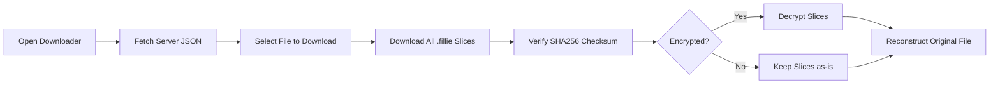

# Fillie – Secure, Cross-Platform File Sharing

**Fillie** is a one-stop solution for seamless and secure file sharing across platforms. It allows users to upload, slice, optionally encrypt, and share files in a custom `.fillie` format. All shared content is indexed in a centralized JSON registry, making it simple to browse and download with full integrity verification.

***

## ✨ Features

- Cross-platform compatibility.
- Optional **end-to-end encryption** for private file sharing.
- Full **integrity verification** using SHA256 checksums.
- Centralized JSON index for content discovery.
- Smart file slicing (≤100MB per piece) for reliable hosting.
- Scalable hosting support: GitHub, IPFS, cloud storage.

***

## 🚀 Objectives

- Provide **safe and simple file sharing** across all systems.
- Support **optional encryption** for privacy and restricted access.
- Maintain **content integrity** through cryptographic security.
- Enable a **centralized, searchable index** for all uploads.

***

## ⚙️ How It Works

### Uploading Files with Fillie Uploader

1. User selects a local file (e.g., `MyDanceVideo.mp3`).
2. Fillie slices the file into `.fillie` chunks (100MB or less).
3. Optionally encrypts each slice.
4. Randomizes filenames for security.
5. Uploads slices to hosting (e.g., GitHub).
6. Updates the **server JSON index** with metadata:
    - File ID
    - Slice count
    - URLs of all slices
    - Encryption status
    - SHA256 checksum

#### Flowchart

***

### Downloading Files with Fillie Downloader

1. User opens the **Fillie Downloader**.
2. Fetches the **server JSON index**.
3. Chooses a file to download.
4. Retrieves all `.fillie` slices.
5. Verifies each slice with a SHA256 checksum.
6. Decrypts slices (if required).
7. Reconstructs the original file seamlessly.

#### Flowchart

***

## 📂 Applications

### Fillie Uploader

- Slice files into manageable chunks.
- Optional file encryption for privacy.
- Upload to hosting service.
- Auto-update the JSON registry.

### Fillie Downloader

- Browse files via index.
- Download and verify integrity.
- Decrypt files when needed.
- Reconstruct and restore original file.

***

## ✅ Advantages

- Flexible **optional encryption**.
- Designed for **cross-platform compatibility**.
- **Integrity verification** prevents tampering.
- **Universal JSON index** for download/browsing.
- Slices make the system **scalable and GitHub-friendly**.

***

## 🔮 Future Enhancements

- **Migrate hosting** from GitHub to IPFS, AWS S3, or GCP for large-scale needs.
- Introduce **database or paginated JSON** for scalability.
- Add **CLI tools** for power users.
- Implement **search, filters, and tags** in the downloader app.
- Introduce **versioned `.fillie` support** for backward compatibility.
- Explore **P2P + decentralized sharing** beyond centralized hosting.

***

